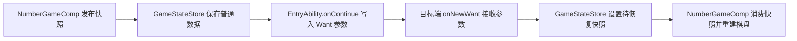
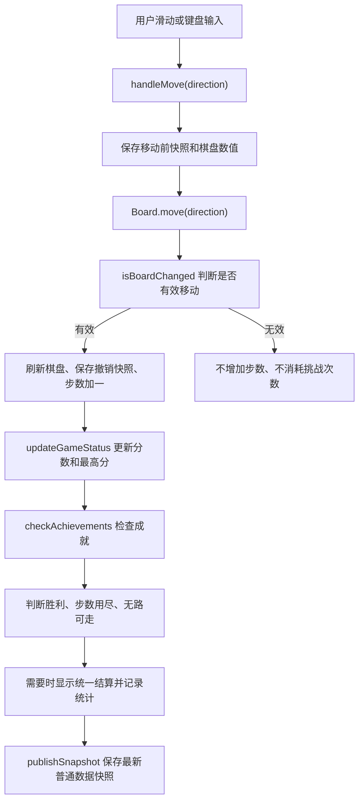
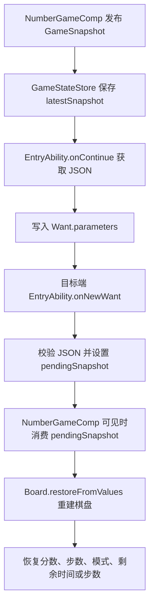

# HarmonyOS 2048 新增功能说明

## 一、项目升级概述

本项目在原有 HarmonyOS 2048 小游戏基础上，对玩法、界面、数据记录和多端适配进行了系统扩展。最终版本不再只是一个单页滑动合成示例，而是包含模式选择、成就系统、统计记录、统一结算反馈、键盘输入、模拟快照恢复和 UIAbility 应用接续配置的 HarmonyOS 小游戏应用。

从源码可以确认，当前工程主要完成了以下升级：

| 功能方向 | 已实现内容 |
| -- | -- |
| 基础体验 | 当前分数、模式最高分、有效步数、新游戏、游戏说明、一步撤销 |
| 多种玩法 | 经典模式、90 秒限时挑战、50 步步数挑战 |
| 结算反馈 | 胜利、无路可走、时间到、步数用尽后的统一结算遮罩 |
| 数据能力 | 游戏快照、模拟快照保存与恢复、模式最高分、成就和统计数据持久化 |
| 多端适配 | phone、tablet、2in1 同一工程部署，600vp 断点切换布局 |
| 交互方式 | 触摸滑动、方向键、W/A/S/D |
| 首页与视觉 | 响应式首页卡片、浅色主题、卡片化信息区和操作区 |

文档以下内容均根据当前最终源码核对，不将未实现或仅预留的能力写成已完成。

## 二、基础游戏体验完善

### 2.1 分数、步数与有效移动

2048 页面在顶部信息区展示当前积分、当前模式最高分和步数信息。普通模式和限时模式显示有效步数，步数挑战模式显示剩余步数。

源码中 `handleMove(direction)` 是触摸滑动和键盘输入共同调用的移动入口。它会在移动前记录棋盘数值，调用 `Board.move(direction)` 后再通过 `isBoardChanged()` 判断棋盘是否真的发生变化：

1. 如果棋盘发生变化，刷新棋盘渲染数据、保存撤销快照、步数加一。
2. 如果棋盘没有变化，不增加步数，也不消耗步数挑战的剩余次数。
3. 撤销快照保存的是移动前的 `GameSnapshot`，因此“撤销一步”会回到上一次有效移动之前的状态。

这种处理保证了无效滑动不会影响统计和挑战规则，也避免了把玩家误操作计入有效步数。

### 2.2 新游戏与游戏说明

页面提供“新游戏”按钮。点击后会重新创建 `Board`，重置分数、步数、限时剩余时间、步数挑战剩余次数、胜负状态、结算状态、成就提示队列和撤销快照。

“游戏说明”通过 `AlertDialog.show()` 展示基础规则，内容包括滑动方向、相同数字合并、经典模式、限时挑战、步数挑战，以及宽屏和 2in1 设备支持方向键与 W/A/S/D。

### 2.3 统一结算反馈

最终版本使用根 `Stack` 中的声明式结算遮罩，而不是分散依赖多个临时弹窗。结算遮罩会展示：

| 展示项 | 来源 |
| -- | -- |
| 结算标题 | `settlementReason`，例如“时间到”“本局结束”“步数挑战结束” |
| 最终分数 | `settlementScore` |
| 最大数字 | `settlementMaxTile` |
| 有效步数 | `settlementSteps` |
| 本模式最高分 | `settlementBestScore` |

不同结算原因会显示不同操作：

| 场景 | 操作 |
| -- | -- |
| 限时结束或步数挑战结束 | 再来一局、返回模式选择 |
| 无路可走且存在撤销快照 | 撤销一步、重新开始、返回模式选择 |
| 无路可走且无撤销快照 | 重新开始、返回模式选择 |
| 合成 2048 | 继续游戏、开始新游戏 |

结算按钮使用固定高度 44vp，避免在手机或平板弹窗中被纵向拉伸。

## 三、多种游戏模式

当前 2048 页面进入游戏前会先显示模式选择页，模式卡片通过 `GameMode` 枚举区分。

### 3.1 经典模式

经典模式没有时间和步数限制，遵循标准 2048 规则。玩家可以一直操作，直到合成 2048 或棋盘无路可走。页面显示当前积分、经典模式最高分和有效步数。

### 3.2 限时挑战

限时挑战使用 `TIMED_TOTAL_SECONDS = 90`，即 90 秒倒计时。进入该模式后，`startTimedTimerIfNeeded()` 启动定时器，每秒减少 `remainingSeconds`。时间归零时调用 `finishTimedGame()`，再进入统一结算流程。

限时模式的页面状态会显示剩余秒数，结算原因记录为 `TIME_UP`，统计结果记录为 `timeout`。限时模式也有独立最高分，存储在 `ModeBestScores.timed` 中。

### 3.3 步数挑战

步数挑战使用 `MOVE_LIMIT_TOTAL_MOVES = 50`，只有棋盘发生变化时才消耗一步。剩余步数归零时进入结算，统计结果记录为 `move_limit_end`。该模式有独立最高分，存储在 `ModeBestScores.moveLimit` 中。

### 3.4 模式数据管理

模式最高分由 `StatisticsStore` 管理，使用 `number_mode_best_scores_v1` 持久化。源码中保留了旧最高分键 `number_best_score` 的兼容读取逻辑，用于将旧数据迁移到经典模式最高分。

## 四、一次开发、多端部署

### 4.1 支持的设备类型

`entry/src/main/module.json5` 中声明了以下设备类型：

```text
phone
tablet
2in1
```

因此手机、平板和 2in1 设备使用同一套工程和同一个 `entry` 模块。

### 4.2 响应式断点

首页和 2048 页面都使用 600vp 作为宽屏断点：

| 页面 | 断点常量 | 宽屏前 | 宽屏后 |
| -- | -- | -- | -- |
| 首页 `Index.ets` | `WIDE_SCREEN_BREAKPOINT = 600` | 纵向滚动列表 | Flex 换行卡片网格 |
| 2048 页面 `NumberGameComp.ets` | `WIDE_SCREEN_BREAKPOINT = 600` | 纵向布局 | 棋盘与控制区左右分栏 |

### 4.3 手机端布局

手机端 2048 页面使用 `Scroll` + `Column` 纵向组织内容，依次显示导航、模式信息、分数信息、操作按钮、快照按钮、次级操作按钮、棋盘和键盘提示。棋盘宽度取内容宽度的 90%，并通过相同宽高保持正方形。

### 4.4 平板与 2in1 宽屏布局

宽屏端使用 `Row` 左右分栏：左侧居中显示棋盘，右侧为控制面板。棋盘大小由内容宽度和高度共同决定：

| 参数 | 作用 |
| -- | -- |
| `WIDE_BOARD_WIDTH_RATIO = 0.52` | 限制棋盘相对宽度 |
| `WIDE_BOARD_HEIGHT_RATIO = 0.86` | 限制棋盘相对高度 |
| `WIDE_BOARD_MAX_SIZE = 520` | 控制最大棋盘边长 |

最终棋盘边长取宽度限制、高度限制和最大尺寸中的较小值，因此能够在平板和 2in1 设备上保持正方形，不会因为横屏高度不足而溢出。

### 4.5 首页卡片适配

首页有三个游戏入口：2048、变色方块、推箱子。手机端以纵向卡片列表展示；宽屏端使用 `Flex` 换行和固定卡片尺寸展示。2048 卡片标记为“多模式、成就、跨设备接续”，变色方块为可进入页面，推箱子显示“开发中”。

## 五、数据自由流转

### 5.1 游戏快照

`GameSnapshot` 是当前工程中用于保存和传递 2048 状态的普通数据结构，字段包括：

| 字段 | 说明 |
| -- | -- |
| `version` | 快照版本，当前为 2 |
| `cells` | 16 个棋盘格数值 |
| `score` | 当前分数 |
| `stepCount` | 当前有效步数 |
| `bestScore` | 当前模式最高分 |
| `won` | 是否已胜利 |
| `lost` | 是否失败 |
| `mode` | 当前游戏模式 |
| `remainingSeconds` | 限时模式剩余秒数 |
| `remainingMoves` | 步数挑战剩余步数 |
| `gameEnded` | 当前局是否结束 |
| `timerStartedAt` | 计时器启动时间标记 |

快照只传递数字、字符串和布尔值，不直接序列化 `Board` 或 `Tile` 类实例。这样做可以避免类实例中的方法、引用关系和运行时状态影响跨 Ability 或字符串化传输，也方便在恢复时通过 `Board.restoreFromValues()` 重建棋盘。

### 5.2 本地模拟接续

当前页面提供“保存快照”和“恢复快照”两个入口，用于单设备验证快照保存、传输和恢复逻辑。

保存时，`NumberGameComp` 调用 `publishSnapshot()`，再由 `GameStateStore.saveSimulationSnapshot()` 将最新快照保存为 JSON 字符串。恢复时，`GameStateStore.prepareSimulationRestore()` 将模拟快照转为待恢复状态，`NumberGameComp.restorePendingSnapshotIfNeeded()` 消费该状态并调用 `restoreSnapshot()`。

恢复过程会还原：

| 状态 | 恢复方式 |
| -- | -- |
| 棋盘 | `Board.restoreFromValues(cells, score, won)` |
| 分数 | 由快照 `score` 设置 |
| 步数 | 由快照 `stepCount` 设置 |
| 模式 | 由快照 `mode` 设置 |
| 限时/步数状态 | 由 `remainingSeconds`、`remainingMoves` 设置 |
| 胜负状态 | 由 `won`、`lost`、`gameEnded` 设置 |

该入口主要用于展示和验证序列化、传递、恢复链路，不等同于系统级跨设备接续实测。

### 5.3 UIAbility 应用接续

源码和配置中已经完成应用接续所需的关键部分：

| 文件 | 实现点 |
| -- | -- |
| `entry/src/main/module.json5` | `continuable: true`，`continueType: ["game2048"]` |
| `EntryAbility.ets` | `onContinue()` 写入快照 JSON 到 `Want.parameters` |
| `EntryAbility.ets` | `onNewWant()` 在新 Want 到来时尝试恢复 |
| `GameStateStore.ets` | 提供最新快照、待恢复快照和 JSON 校验 |
| `NumberGameComp.ets` | 页面显示时消费待恢复快照并重建棋盘 |

接续流程为：



需要客观说明的是：当前工程已实现应用接续相关代码和配置，并通过编译；如果没有两台满足条件的 HarmonyOS 设备完成系统级接续实测，不能表述为“已完成真机跨设备验证”。本次最终演示主要通过模拟快照展示数据恢复链路。

## 六、成就系统

成就定义集中在 `GameModels.ets`，状态由 `AchievementStore` 通过 Preferences 持久化，存储键为 `number_achievements_v1`。

### 6.1 成就列表

| 成就 ID | 名称 | 解锁条件 |
| -- | -- | -- |
| `tile_32` | 初出茅庐 | 首次合成 32 |
| `tile_128` | 小有成就 | 首次合成 128 |
| `tile_512` | 数字大师 | 首次合成 512 |
| `tile_2048` | 最终目标 | 首次合成 2048 |
| `efficient_128` | 效率玩家 | 20 次有效移动以内合成 128 |
| `timed_master` | 限时高手 | 限时模式中达到 1000 分 |
| `ten_games` | 坚持不懈 | 完成 10 局游戏 |

### 6.2 解锁与展示

成就检测发生在棋盘完成有效移动并更新状态之后。`checkAchievements()` 会读取当前最大数字、有效步数、分数、模式和总局数，再交给 `AchievementStore.unlockByGameState()` 判断。

同一成就只在第一次满足条件时解锁。解锁后：

1. 成就对象的 `unlocked` 设为 `true`。
2. `unlockedAt` 记录解锁时间。
3. 新解锁成就加入提示队列。
4. 页面顶部显示“解锁成就”浮层，多个成就按队列逐个显示。
5. 成就面板立即更新已解锁数量和每项状态。
6. 成就数据异步写入 Preferences。

`AchievementStore` 会合并默认定义和已保存记录，保证新增成就定义不会因为旧数据缺少字段而丢失。

## 七、游戏数据统计

统计能力由 `StatisticsStore` 实现，使用 `number_statistics_v1` 保存总体统计，使用 `number_mode_best_scores_v1` 保存各模式最高分。

### 7.1 已实现统计项

| 统计项 | 字段 |
| -- | -- |
| 总游戏局数 | `totalGames` |
| 经典模式局数 | `classicGames` |
| 限时模式局数 | `timedGames` |
| 步数挑战局数 | `moveLimitGames` |
| 胜利次数 | `wins` |
| 失败次数 | `losses` |
| 历史最高分 | `bestScore` |
| 最大合成数字 | `maxTile` |
| 累计有效步数 | `totalMoves` |
| 最少达到 128 的步数 | `bestStepsTo128` |
| 最少达到 2048 的步数 | `bestStepsTo2048` |
| 最近游玩时间 | `lastPlayedAt` |
| 最近游戏记录 | `recentRecords` |

最近记录最多保留 5 条。每条记录包含模式、分数、最大数字、步数、结果、游玩时间以及限时/步数挑战的剩余状态。

### 7.2 空数据和旧数据兼容

统计读取失败、数据为空或 JSON 解析失败时，会回退到 `getDefaultStatistics()`。数字字段通过 `safeNumber()` 处理，非法或负数会转为 0。模式最高分支持从旧键 `number_best_score` 读取旧经典模式最高分，避免旧版本数据直接丢失。

## 八、键盘与多种交互方式

当前 2048 棋盘支持触摸滑动，也支持带键盘设备使用方向键和 W/A/S/D。

| 输入方式 | 实现 |
| -- | -- |
| 触摸滑动 | `PanGesture` 分别绑定上下左右 |
| 方向键 | `KeyCode.KEYCODE_DPAD_*` 和常见硬键码兜底 |
| W/A/S/D | 映射到上/左/下/右 |

根 `Stack` 和棋盘容器都绑定了 `onKeyEvent()`，并通过 `focusControl.requestFocus(KEY_TARGET_FOCUS_ID)` 保持键盘焦点。按键最终复用 `handleMove(direction)`，因此键盘和触摸滑动共享同一套有效移动判断、步数统计、撤销快照、成就检测和结算逻辑。

源码未实现其它快捷键，因此文档不额外声明更多键盘操作。

## 九、视觉与交互设计优化

最终界面采用浅色主题，入口页和 2048 页面都以卡片化信息组织为主。

### 9.1 首页

首页背景为浅紫灰色，游戏入口卡片使用白色底、浅色边框和标签。手机端为纵向列表，宽屏端为居中 Flex 卡片网格。2048 卡片显示“多模式、成就、跨设备接续”等标签，帮助用户理解该入口的扩展内容。

### 9.2 2048 页面

2048 页面使用以下视觉层次：

| 元素 | 设计 |
| -- | -- |
| 背景 | `#F5F2FA` 浅色页面背景 |
| 主色 | `#6C4CCF` |
| 深主色 | `#49318C` |
| 卡片 | 白色背景、浅色边框、圆角 |
| 棋盘 | 浅紫灰棋盘底色和空格底色 |
| 按钮 | 主按钮、次按钮、三类按钮区分 |

模式选择、分数卡片、成就面板、统计面板和结算遮罩均保持统一的圆角、间距和卡片风格。成就解锁使用顶部浮层提示，结算使用居中遮罩卡片，避免胜负反馈散落在多个临时弹窗中。

## 十、主要文件修改说明

| 文件 | 主要作用 |
| -- | -- |
| `entry/src/main/ets/pages/Index.ets` | 首页游戏入口、响应式卡片布局、三个游戏入口展示 |
| `entry/src/main/ets/pages/NumberGame.ets` | 2048 页面入口，挂载 `NumberGameComp` |
| `entry/src/main/ets/entryability/EntryAbility.ets` | 应用接续中快照写入 Want 和新 Want 恢复 |
| `entry/src/main/module.json5` | 声明 phone/tablet/2in1、`continuable` 和 `continueType` |
| `features/number/Index.ets` | 导出 2048 组件和接续相关 Store 类型 |
| `features/number/src/main/ets/views/NumberGameComp.ets` | 2048 主页面、模式、布局、输入、结算、成就和统计入口 |
| `features/number/src/main/ets/services/helper.ets` | `Board` 和 `Tile`，负责棋盘移动、合并、胜负判断、导出和重建 |
| `features/number/src/main/ets/services/GameModels.ets` | 游戏模式、成就、统计、常量和数据结构定义 |
| `features/number/src/main/ets/services/GameStateStore.ets` | 游戏快照、模拟恢复、接续恢复的数据中转 |
| `features/number/src/main/ets/services/PreferencesUtil.ets` | Preferences 读写封装 |
| `features/number/src/main/ets/services/AchievementStore.ets` | 成就加载、解锁、保存和默认定义合并 |
| `features/number/src/main/ets/services/StatisticsStore.ets` | 模式最高分、局数统计和最近记录持久化 |
| `entry/src/main/resources/base/element/color.json` | 首页浅色主题和卡片颜色 |
| `features/number/src/main/resources/base/element/color.json` | 2048 页面主题、棋盘、按钮和卡片颜色 |

## 十一、关键数据流与实现流程

### 11.1 有效移动流程



### 11.2 应用接续流程



## 十二、测试与运行效果

### 12.1 手机端测试

手机端重点验证：

| 项目 | 说明 |
| -- | -- |
| 首页 | 三个游戏卡片纵向展示，2048 可进入 |
| 三种模式 | 经典、限时、步数挑战可选择 |
| 滑动 | 上下左右滑动可移动棋盘 |
| 撤销 | 有效移动后可撤销一步 |
| 快照 | 可保存模拟快照并恢复 |
| 成就 | 首次达成条件后显示解锁提示并更新面板 |
| 统计 | 结算后更新局数、胜负、最近记录等数据 |
| 结算 | 时间到、无路可走、步数用尽或胜利显示统一遮罩 |

### 12.2 平板 / 2in1 测试

平板和 2in1 重点验证：

| 项目 | 说明 |
| -- | -- |
| 宽屏首页 | 游戏入口以卡片网格方式排列 |
| 2048 宽屏页 | 棋盘和控制区左右分栏 |
| 正方形棋盘 | 棋盘随屏幕变化保持正方形 |
| 键盘操作 | 方向键与 W/A/S/D 均可移动 |
| 限时结算 | 90 秒归零后显示结算遮罩 |
| 成就与统计 | 宽屏下成就面板、统计面板可正常展示 |

### 12.3 数据自由流转测试

最终演示主要通过本地模拟快照验证数据恢复：

1. 在游戏中保存模拟快照。
2. 继续移动改变棋盘、分数、步数或模式状态。
3. 点击恢复模拟快照。
4. 检查棋盘格、分数、步数、模式、限时或步数挑战剩余状态是否回到保存时。

系统级跨设备接续需要满足 HarmonyOS 多设备环境条件，当前文档只说明工程已实现相关代码和配置。

## 十三、录屏文件

当前最终新增功能演示视频使用：

```text
videos/video3_new_features.mp4
```

该视频用于展示最终新增功能的主要运行效果，包括 2048 新模式、界面改造、成就/统计、快照恢复等新增能力。视频目录中还保留了早期基础运行和中间功能演示文件，但最终说明文档以 `video3_new_features.mp4` 作为最终新增功能演示文件。

## 十四、当前限制

1. 系统级跨设备接续通常需要两台满足条件的 HarmonyOS 设备、相同账号或可信设备环境。当前工程已实现接续代码和配置，并通过编译；文档不声明已经完成真实双设备接续实测。
2. 本地 Preferences 主要用于保存成就、统计和最高分，它不是跨设备数据自由流转本身；跨 Ability 或跨设备传递依赖的是 `GameSnapshot` 普通数据结构。
3. 推箱子入口目前显示“开发中”，不能写成已实现游戏。
4. 成就系统只包含源码中定义的 7 个成就，不额外声明未实现成就。
5. 键盘输入只支持方向键和 W/A/S/D，不声明其它快捷键。

## 十五、总结

最终版本将原有 2048 示例扩展为一个较完整的 HarmonyOS 小游戏模块。它不仅保留了数字合并的基础玩法，还加入了经典、限时和步数挑战三种模式，提供成就、统计、统一结算、撤销、键盘输入、响应式布局和快照恢复能力。

从 HarmonyOS 工程角度看，本项目覆盖了 ArkUI 组件化布局、`@State` 状态驱动界面、`Scroll`/`Row`/`Column`/`Grid`/`Flex` 响应式组合、Preferences 本地持久化、Ability 接续参数传递和多设备类型配置。整体成果已经从一个基础开源示例升级为具备多端适配、数据记录、交互反馈和接续能力的小型游戏应用。
