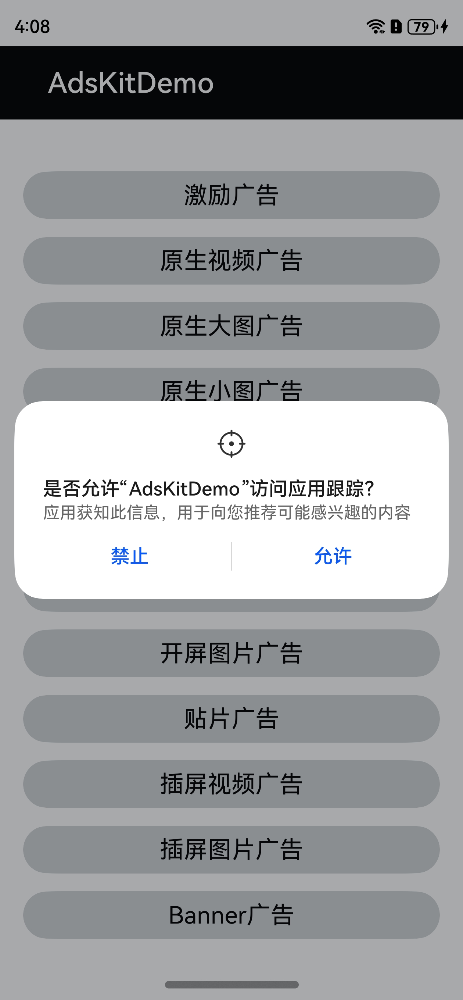
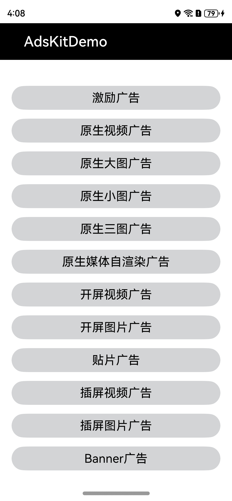
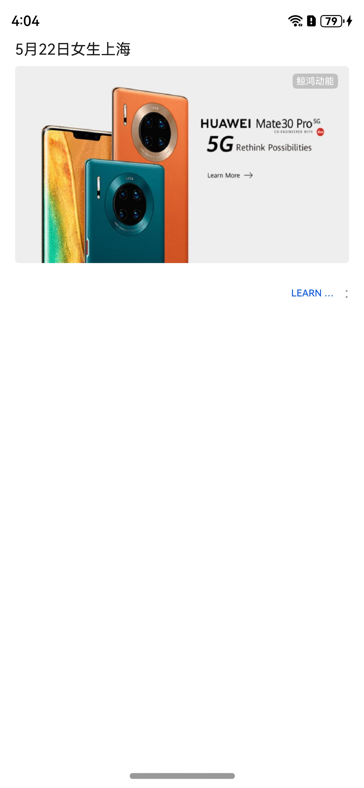
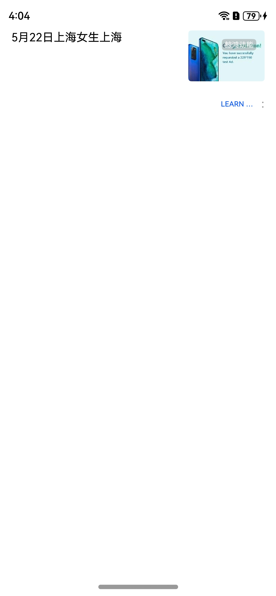
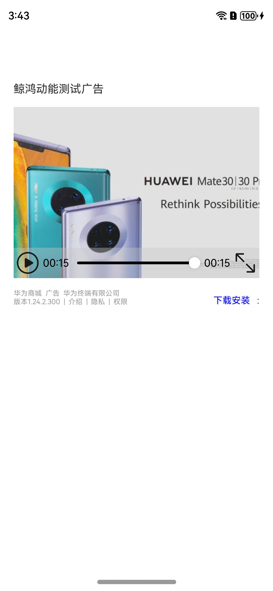

# 鲸鸿动能广告服务HarmonyOS ArkTs示例代码
中文 | English
## 目录

* [简介](#简介)
* [安装](#安装)
* [效果预览](#效果预览)
* [工程目录](#工程目录)
* [示例代码](#示例代码)
* [约束与限制](#约束与限制)
* [授权许可](#授权许可)


## 简介
鲸鸿动能广告服务HarmonyOS ArkTs示例代码向您介绍如何在应用中使用将鲸鸿动能API并实现广告展示。

## 安装
在HarmonyOS系统手机上安装该示例代码项目。

## 效果预览
| **OAID允许弹框页面**                                  | **广告样式主页面**                        | **激励广告页面**                                 |
|-------------------------------------------------|------------------------------------|--------------------------------------------|
|  |  |  | 

| **原生视频广告页面**                       | **原生大图广告页面**                         | **原生小图广告页面**                         |
|------------------------------------|------------------------------------|------------------------------------|
|  |  |  |

| **原生三图广告页面**                            | **原生媒体自渲染广告页面**                            | **开屏视频广告页面**                                      |
|-------------------------------------|-------------------------------------|---------------------------------------------------|
|  | |   |

| **开屏图片广告页面**                                        | **贴片广告页面**                                             | **插屏视频广告页面**                                     |
|-----------------------------------------------------|-------------------------------------|--------------------------------------------------------|
|  |  |  |

| **插屏图片广告页面**                                       | **Banner广告页面**                            |
|--------------------------------------------|-------------------------------------------|
|  | | 

## 工程目录
```
├─entry/src/main/ets               // 代码区  
│ ├─constant                       // 存放常量                         
│ │ └─AdType.ets                   // 广告类型枚举类 
│ ├─entryability
│ │ └─EntryAbility.ets             // 主程序入口类
│ ├─event   
│ │ └─AdStatus.ets                 // 广告回调状态枚举类
│ │ └─InterstitialAdStatusHandler.ets // 插屏广告事件订阅类
│ │ └─RewardAdStatusHandler.ets    // 激励广告事件订阅类
│ ├─log   
│ │ └─HiAdLog.ets                  // 日志组件
│ ├─pages                          // 存放页面文件目录                
│ │ ├─AdsServicePage.ets           // 应用主页面
│ │ ├─BannerAdPage.ets             // Banner广告主页面
│ │ ├─NativeAdPage.ets             // 原生广告主页面 
│ │ ├─PlacementAdPage.ets          // 贴片广告主页面
│ │ ├─SelfRenderAdPage.ets         // 原生媒体自渲染广告主页面
│ │ ├─SplashFullScreenAdPage.ets   // 开屏广告全屏开屏广告页面                
│ │ └─SplashHalfScreenAdPage.ets   // 开屏广告半屏开屏广告页面
│ ├─widgets                        // 公共组件
│ │ ├─action-bar.ets               // action bar组件    
│ │ └─custom-button.ets            // button组件
│ │ └─form-item-text.ets           // form-item-text组件
└─entry/src/main/resources         // 资源文件目录
```
## 示例代码
### 流量变现服务示例代码
鲸鸿动能广告服务HarmonyOS-ArkTs示例代码为您提供激励广告的展示页面。
本示例代码包括以下文件，便于您进行广告请求、广告展示：

1). AdsServicePage.ets
流量变现服务演示界面，可以请求并展示Banner广告、激励广告、原生广告、开屏广告、贴片广告、插屏广告，点击对应按钮可以展示相应的广告内容。
<br>代码位置： entry\src\main\ets\pages\AdsServicePage.ets</br>

2). NativeAdPage.ets
用于展示原生广告。
<br>代码位置：entry\src\main\ets\pages\NativeAdPage.ets</br>

3). PlacementAdPage.ets
用于展示贴片广告。
<br>代码位置：entry\src\main\ets\pages\PlacementAdPage.ets</br>

4). SplashFullScreenAdPage.ets
用于展示开屏全屏广告。
<br>代码位置：entry\src\main\ets\pages\SplashFullScreenAdPage.ets</br>

5). SplashHalfScreenAdPage.ets
用于展示开屏半屏广告。
<br>代码位置：entry\src\main\ets\pages\SplashFullScreenAdPage.ets</br>

6). BannerAdPage.ets
用于展示Banner广告。
<br>代码位置：entry\src\main\ets\pages\BannerAdPage.ets</br>

## 约束与限制

1. 本实例仅支持标准系统上运行，支持设备：华为手机。
2. HarmonyOS系统：HarmonyOS NEXT Developer Beta1及以上。
3. DevEco Studio版本：DevEco Studio NEXT Developer Beta1及以上。
4. HarmonyOS SDK版本：HarmonyOS NEXT Developer Beta1 SDK及以上。

## 授权许可
鲸鸿动能广告服务HarmonyOS-ArkTs示例代码经过 [Apache License, version 2.0](http://www.apache.org/licenses/LICENSE-2.0)授权许可。